# Architecture

## Stack decision

Use Flutter for the application shell and a device-agnostic native Android
playback path, with two independent compatibility engines.

| Concern | Choice | Why |
| --- | --- | --- |
| TV UI | Flutter Material primitives plus a custom focus layer | Full control over a branded 10-foot UI; every action is focusable and remote-driven. |
| TV navigation | `Focus`, `FocusTraversalGroup`, `Shortcuts`, and `Actions` | Predictable D-pad behavior without depending on the deprecated Android Leanback UI library. |
| Video | AndroidX Media3 1.11.0 `PlayerView`/`SurfaceView`, then `media_kit`/libmpv and libVLC | Media3 renders directly to a native surface by default; MPV/libass handles styled ASS and unusual codecs; VLC is the final software fallback. |
| State | Riverpod | Testable feature-scoped state and dependency injection. |
| Routing | `go_router` | Declarative home, detail, auth, and player navigation. |
| HTTP | Dio for application APIs; Media3's OkHttp data source for playback | Typed/cancelable API boundaries plus redirect, range-request, and debrid-header support in the native player. |
| Secrets | `flutter_secure_storage` | Android Keystore-backed storage for user tokens. |
| Local state | SQLite (`sqflite`, WAL mode) | Exact resume, history, per-series settings, compatibility failures, catalog cache, and performance events. |
| Native TV | Kotlin activity and method channel | Direct-surface Media3 playback, MediaSession, Watch Next, reminders, codec/display/audio capabilities, and display mode selection. |
| Metadata | AniList GraphQL with mapped Kitsu search/details fallback | AniList remains canonical; Kitsu keeps title search usable during documented AniList API suspensions while preserving AniList/MAL IDs. |
| Auth | Direct Real-Debrid device OAuth plus a tracker pairing broker | Real-Debrid exposes a TV-friendly device flow; AniList/MAL authorization is adapted by a small server so secrets never ship in the APK. |
| Debrid | Real-Debrid, TorBox, AllDebrid, and Premiumize APIs | Magnets are processed remotely and only provider-generated HTTPS streams reach either player. |

Flutter remains responsible for catalog, account, stream-resolution, and TV
navigation UI. Full-screen video is deliberately hosted by a Kotlin activity:
Media3's `PlayerView` creates and owns a real `SurfaceView`, so decoded frames
do not pass through Flutter's `TextureRegistry`, a `TextureView`, a virtual
display, or platform-view composition. This keeps the UI portable while
removing the shared texture path that caused black, corrupt, or choppy output
on some Android TV and Fire TV graphics stacks.

## Module boundaries

```text
lib/
  app/                       app composition and routes
  core/
    config/                  compile-time, non-secret configuration
    theme/                   visual tokens
    tv/                      focus and remote input primitives
    platform/                Android TV native bridge
    storage/                 SQLite state and history
    diagnostics/             redacted support report export
  features/
    auth/                    pairing broker client and secure token handoff
    catalog/                 AniList metadata, mapped Kitsu outage fallback,
                             and domain models
    home/                    TV shelves and hero presentation
    player/                  native Media3 orchestration, MPV/VLC fallbacks,
                             resume, diagnostics, and remote controls
    streaming/               user-configured sources plus debrid resolvers
    tracking/                MAL/AniList list and mutation contracts
```

Each integration sits behind a domain interface. UI code must not know whether
a release came from a local provider adapter, a hosted resolver, or a test
fixture.

## Playback pipeline

```mermaid
flowchart LR
    A["Episode selection"] --> B["Title and episode normalizer"]
    B --> C["Release source adapters"]
    C --> D["Candidate scorer"]
    D --> E["Choose connected debrid service"]
    E --> F["Check provider cache or earliest supported readiness signal"]
    F -->|Ready| G["Select the requested episode file"]
    F -->|Not ready| X["Cancel/delete temporary provider item"]
    X --> D
    G --> H["Request provider HTTPS stream"]
    H --> J["Debrid-only player gate"]
    J --> R{"H.264 Hi10P or software-only release?"}
    R -->|No| K["Native Media3 1.11.0 PlayerView / SurfaceView"]
    R -->|Yes| K1["MPV/libass with software preference"]
    K -->|Bad stream| D
    K -->|Unsupported, no first frame, or persistently choppy| K1
    K1 -->|Final compatibility fallback| K3["libVLC software player"]
    K --> K2["Checkpoint, MediaSession, Watch Next"]
    K1 --> K2
    K3 --> K2
    K2 --> L["Tracking completion policy"]
    L --> M["Durable sync outbox"]
    M --> N["AniList and/or MAL mutation"]
```



Important implementation rules:

- Normalize AniList titles, synonyms, season number, episode number, release
  group, resolution, codec, and batch status before ranking results.
- Real-Debrid no longer documents its former instant-availability endpoint.
  Add the magnet, select the matching file, and use torrent status/progress;
  cached entries normally reach `downloaded` almost immediately.
- A batch must select only the matching video file. All engines expose
  embedded audio/subtitle tracks; MPV/libass can also use Matroska font
  attachments and full ASS styling.
- Keep debrid and source-provider API code outside widgets.
- Treat an unrestrict URL as short-lived and never persist it in logs.
- Emit playback progress locally. Queue a tracking mutation after natural
  completion or a configurable threshold (for example, 85-90%), and make the
  mutation idempotent so retries cannot decrease progress.
- Keep the tracking outbox locally until both the provider response and local
  state agree.

Only index and stream material the user is legally permitted to access. Source
adapter terms and AniList API terms must be reviewed before public
distribution.

## Player behavior in this foundation

Normal playback starts in `Media3PlayerActivity` with AndroidX Media3 1.11.0.
Its `PlayerView` is verified at runtime to own a real `SurfaceView`; failure to
create that surface stops the native session instead of silently returning to
a Flutter texture. `DefaultRenderersFactory` enables decoder fallback, while a
memory-class-aware `DefaultLoadControl` avoids assuming a particular Fire TV,
Shield, Chromecast, or generic Android TV model. Media is read through
`OkHttpDataSource`, including request headers, redirects, retries, and byte
ranges required by debrid HTTPS streams.

The native player records an exact checkpoint every five seconds and returns
position, duration, completion, decoder, first-frame, dropped-frame, codec,
ABI, and memory diagnostics to Flutter. A first-frame watchdog catches
audio-with-black-video failures, and sustained excessive frame drops are
treated as a compatibility failure. The orchestrator can try up to two better
ranked debrid streams before changing engines.

Release metadata is checked before hardware playback. H.264 releases labelled
Hi10P, High 10, 10-bit, or `yuv420p10` are routed to MPV with software decoding
preferred, because Android hardware decoders commonly do not implement H.264
High 10. Media3 remains the default for ordinary H.264, HEVC, VP9, AV1, and
other device-supported profiles. MPV/libass is the compatibility engine for
advanced ASS and unusual containers/codecs; libVLC software playback is the
final fallback rather than the primary path.

The TV control layer remains remote-first:

- D-pad arrows: reveal and navigate the focusable control row; they never seek
  while a control has focus.
- Center/Enter/K: activate the focused control or play/pause from the player
  root.
- J/L or media rewind/fast-forward: seek 10 seconds and show a trickplay
  preview when the device permits frame capture.
- S: cycle subtitles; M/gamepad Y: open playback options; A/gamepad X: cycle
  picture fit; C: engage software compatibility decoding.
- Back: return through normal Android navigation.

Do not infer successful video from audio progress or decoded dimensions alone;
Media3's `onRenderedFirstFrame` callback is the authoritative first-frame
signal. Preserve the latest checkpoint whenever an engine or stream changes.
Validate HEVC 10-bit, AV1, Dolby/DTS licensing behavior, H.264 Hi10P software
performance, and ASS-heavy samples on physical target boxes; emulator success
is not enough for codec certification.

## ABI and device policy

Playback policy is capability-driven rather than tied to a manufacturer or
model name. Runtime diagnostics report `Build.SUPPORTED_ABIS`, Android API
level, memory class, low-RAM status, selected decoder, codec, resolution, frame
rate, surface readiness, and dropped frames. Buffering and fallback decisions
use those capabilities and observed playback behavior.

Release builds support the Android TV/Fire TV ABI matrix:

- `armeabi-v7a` for 32-bit TV application runtimes, including many Fire TV
  models;
- `arm64-v8a` for 64-bit Android TV, Google TV, and Shield-class devices;
- `x86_64` for Android TV/Google TV emulators.

Public releases use one universal APK containing `armeabi-v7a` and
`arm64-v8a`, so users never need to select an ABI. `x86_64` remains available
for debug/emulator builds only. CPU marketing names are not sufficient: a
device with a 64-bit CPU can still expose only a 32-bit app ABI.
